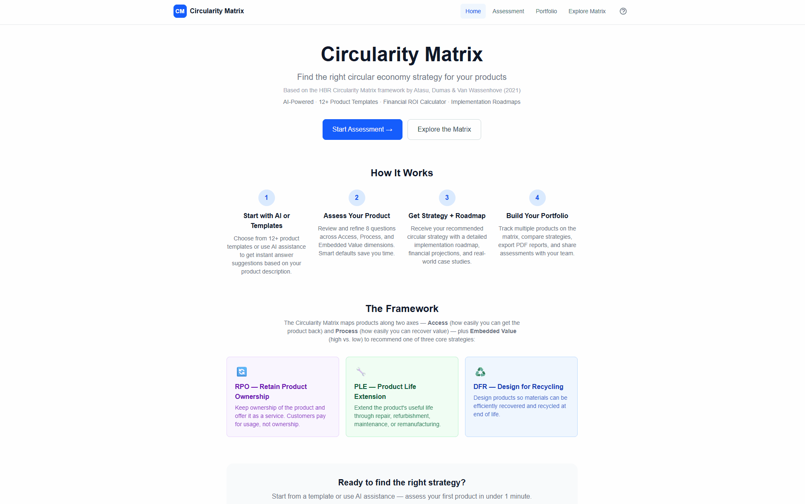

# Circularity Matrix

A decision-support tool that helps identify the right circular economy strategy for a product, based on the HBR Circularity Matrix framework [Atasu, Dumas & Van Wassenhove, 2021](https://hbr.org/2021/07/the-circular-business-model).

Users answer 8 questions across three dimensions — access difficulty, process difficulty, and embedded value — and the tool maps their product onto an 8-cell matrix recommending one or more strategies: Retain Product Ownership (RPO), Product Life Extension (PLE), or Design for Recycling (DFR).

On a personal note, I built this project as I worked on portfolio circularity assessments at a large industrial tech company. I wanted a simple, interactive way to apply the HBR framework to our products and communicate strategy recommendations to stakeholders. This tool is the result — a lightweight, client-side app that can be easily deployed and shared.

### Live Demo: [circularity-matrix.vercel.app](https://circularity-matrix.vercel.app/)

## Demo/Screenshot



## Features

- **Assessment wizard** — 8-question questionnaire with presets, AI-assisted answers, and what-if analysis
- **Strategy recommendations** — RPO, PLE, and DFR strategies with examples, roadmaps, and financial projections
- **Portfolio management** — Track and compare multiple products on a single interactive matrix
- **Export & share** — Download PDF reports, export JSON/CSV, or share via URL
- **Matrix explorer** — Browse all 8 strategy cells without taking the assessment

## Tech Stack

- Next.js (App Router, TypeScript, static export)
- Tailwind CSS v4
- jsPDF (client-side PDF generation)
- React Context + localStorage for state

No backend. No database. No external API calls. Deploys as a static site.

## Getting Started

```bash
npm install
npm run dev
```

Open [http://localhost:3000](http://localhost:3000).

## Build & Deploy

```bash
npm run build
```

Produces a static export in `out/`. Deploy to any static host (Vercel, Netlify, GitHub Pages, etc.).

## Project Structure

```
src/
├── app/          Pages (landing, assess, portfolio, explore)
├── components/   UI components (matrix, wizard, results, roadmaps, financial calc)
└── lib/          Domain logic (types, questions, scoring, strategies, presets, AI, PDF)
```

## License

MIT

## Created by
**Raka Adrianto** — Sustainability Product Manager

- GitHub: [@lugasraka](https://github.com/lugasraka)
- LinkedIn: [linkedin.com/in/lugasraka](https://www.linkedin.com/in/lugasraka/)

---

Feedback and contributions welcome! Open an issue or submit a pull request.
